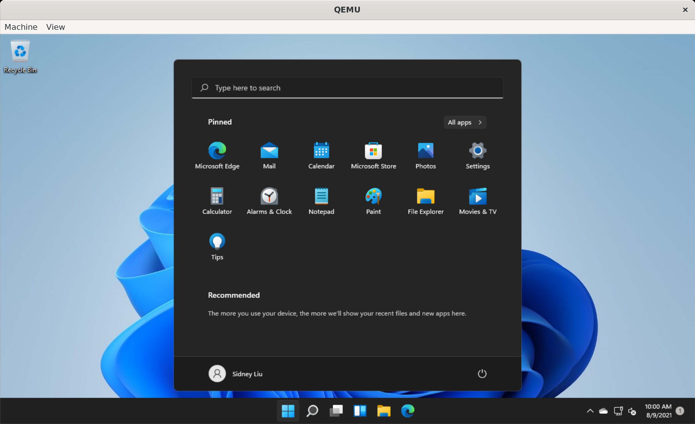

# Samsung Galaxy Chromebook

This simple page documents my experience with Samsung Galaxy Chromebook. Samsung Galaxy Chromebook is a great performmance laptop, comparable to other capable Windows laptops. The specs are impressive (comparing to chromebooks, slightly above average comparing to other Windows laptops). Screen is gorgeous, performance is top notch, and the included pen is a delight to use. That's why I couldn't resist the bargain when I saw Best Buy had a practically new one for sale for $450 (just the laptop and charger) in March, 2021. I wish that the battery would last longer and hard drive is bigger, given my intention of using this as my Linux development laptop. Overall, much better deal comparing to the Samsung Galaxy Chromebook 2 (botched).

1) <b>Specifications</b>

Processor / Chipset: Intel® Core™ i5-10210U Processor(1.60 GHz up to 4.20 GHz 6 MB L3 Cache) 
Color: Mercury Gray 
Display: 13.3" UHD AMOLED Display (3840 x 2160) with Touch Screen Panel, 360 degree rotating display 
Memory: 8 GB LPDDR3 Memory (On BD 8 GB) 
Hard Drive: 256 GB SSD NVME 2230 
Graphics: Intel® UHD Graphics 
Sound: Stereo Speakers ( 2 W x 2 ), Internal Digital Dual Array Mic + Mono Mic, 1 Headphone out/Mic-in Combo 
Camera: 1M Camera (front), 8M Camera (on keyboard deck) 
Wireless: Wi-Fi 6 (Gig+), 802.11 ax 2x2, Comet Lake PCH-LP CNVi WiFi, Bluetooth 
Touch Pad: Island-type keyboard (Backlit keyboard), PEN 
Spill Resistant:3cc 
Ports: 2 USB-C® [up to 5Gbps*, 4K display out with optional adapter, Charging] USB3.0, UFS & MicroSD Combo 
Battery: 4Cell/Li-ion 6390mAh, 8hrs 
Power: 49.2 Wh (Typical), 65 W / 45 W USB-C® Adapter* 
Security & Safety: TPM, FingerPrint Reader 
Certification: ENERGY STAR® Certified 
Included in Box Accessories: Adapter, Pen Tip/Tweezer, Quick Start Guide, Warranty Card 
Dimensions & Weight: (L x W x H) 11.92" x 8.0" x 0.39", Weight: 2.29 
Warranty: 1 Year 

2) <b>Running Linux</b>

I prefer running Linux directly, using Crouton, after comparing built-in Linux Developer Environment and using Chromebrew.

<ol>
<li>Built-in <b>Linux Developer Environment</b> is a containerized VM. Although it is quite usable, it is a virtual machine environment. Performance penalty will incur. There are still some things need to be ironed out, such as missing icons. </li>

<li><b>Chromebrew</b> (https://github.com/skycocker/chromebrew) is a chromebook package manager much like apt or dnf. In general, I feel that the disadvantage of size and complexity of the tool outweights its benefits. It works well for the situations where you need a couple of must-have tools.</li>

<li><b>Crouton</b> (https://github.com/dnschneid/crouton) is a chroot environment, much closer to native Chromeos. The performance difference is almost negligible. I also like the fact that it is somewhat isolated from the chromeos. In addition to xiwi which provides a X11 on chromeos, sommelier (https://github.com/jcdang/chromeos-ubuntu-sommelier) is available as well. Sommelier solution provides a more integrated solution and allows running Linux X11 and Xwayland apps seamlessly.</li>

</ol>

I run the following crouton to install Debian Bullseye:

      sudo crouton -r bullseye -t x11,xorg,xiwi,cli-extra,audio,keyboard,extension,xfce

With Crouton no longer supported (09/2023), crouton is devolved into, or you will set error messages:

      sudo CROUTON_BRANCH=silence crouton -r bookworm -t x11,xorg,cli-extra,xfce
      
What <b>does NOT</b> work in crouton:

<ul>
<li>docker - Unfortunately, I am unable to get docker to work in chroot environment. Got error message: Cannot connect to the Docker daemon at unix:///var/run/docker.sock. However, docker works with Crostini container.</li>
</ul>

UPDATE: As of July 15th, 2023, crouton is no longer being developed and maintained. Many things are broken, e.g., the above command gave an error, unable to install. I have since switched to Depthboot approach described below.

3) <b>Sommelier vs xiwi vs Native Wayland</b>

Sommelier provides support to run X apps via Xwayland. Comparing to xiwi, a chrome extension, it's much more natural and responsive. However, native Chromebook Wayland support integrates with ChromeOS directly. Apps runs natively and in almost bare metal speed. I start to use only apps that support wayland, eliminating the steps that launches sommelier to support xwayland. But running sommelier might still be needed if your apps do not support wayland yet. Some apps, such as chromium browser, additional option <i>--ozone-platform=wayland</i> needs to be appended to the command.

      sommelier -X --x-display=:0 --no-exit-with-child /bin/sh -c "~/sommelierrc" &

The only thing a chroot CLI environment needs is to source the following:

      export GDK_BACKEND=wayland
      export CLUTTER_BACKEND=wayland
      export XDG_RUNTIME_DIR='/var/run/chrome'
      export WAYLAND_DISPLAY=wayland-0
      export DISPLAY=:0
      #alias sommelier="${HOME}/Downloads/sommelier/bin/sommelier -X --x-display=:0"

      if test -z "$DBUS_SESSION_BUS_ADDRESS" ; then
                 ## if not found, launch a new one
                 eval `dbus-launch --sh-syntax`
                 ##echo "D-Bus per-session daemon address is: $DBUS_SESSION_BUS_ADDRESS"
      fi
      export DBUS_SYSTEM_BUS_ADDRESS='unix:path=/var/host/dbus/system_bus_socket'

      # add the following to enable Qt5 wayland related apps, such as Calibre, Okular
      # but no titlebar is shown.

      #export QT_QPA_PLATFORM=wayland-egl falkon

4) <b>Running Windows VM</b>

Why? First of all, because I can! :) Secondly, it's for those occasions that Windows is the only supported option. I have been using Windows 11 VM for a while now. It runs quite well and stable and performance is quite good.

Go into chroot by running:
      
      sudo startcli

Get more packages for qemu:

      sudo apt install qemu qemu-kvm

This is the qemu command line options I use to run Windows 11 VM:

      qemu-system-x86_64 \
        -m 4096 \
        -smp 2 \
        -vga qxl \
        -display default,show-cursor=on \
        -usb \
        -device usb-tablet \
        -device usb-mouse \
        -machine type=q35,accel=kvm \
        -bios /usr/share/OVMF/OVMF_CODE.fd \
        -boot order=c \
        -cdrom /home/<user>/Downloads/VM/virtio-win-0.1.190.iso \
        -drive file=/home/<user>/Downloads/VM/win11.qcow2,if=virtio \
        -drive file=/home/<user>/Downloads/VM/data.qcow2,if=virtio \
        -cpu Skylake-Client-IBRS
        

5) <b>SSD Upgrade</b>

I got a Western Digital CH SN530 1TB 2230 NVME SSD, after seeing this video https://www.youtube.com/watch?v=QAyFRj-gORI.

Unfortunately, after running Recovery and messing around with it, the laptop gives "Chrome OS is missing or damaged" and unable to proceed further. I tried to install different operating systems such as Windows 10 and Ubuntu 21.04 on it on a different laptop, with success. I think it might be due to the WD 1TB uses 4096 physical sector size, causing trouble for Chromeos UEFI booting. This might be in the firmware or something. Just my wild guess.
      
For now, I will just put this SSD into a NVME enclosure, and use it as a portable USB, until newer versions of Chromeos support this SSD, hopefully soon.

UPDATE: As of July 8th, 2022, I can report that Version 103.0.5060.114 works fine with this 1TB SSD!

UPDATE: As of Nov 22nd, 2022, WD 1TB SSD causing sleep problem. 

6) <b>Firmware Update</b>

Samsung Galaxy Chromebook has a UEFI Firmware (Full ROM) available now here https://mrchromebox.tech/#devices. You can follow this Multiboot guide https://github.com/olm3ca/Galaxy-Chromebook on how to multiboot linux or Windows 11, even Mac. What that means is that, if you install this UEFI firmware, you will have to blow away ChromeOS. I am not ready to do that just yet, because I am not sure if I could recover back to Chromeos, and I am actually a fan of Chromeos. 

I had an older Samsung Chromebook 3 that has support for RW_LEGACY Firmware. I tried out the <a href="https://galliumos.org/">GalliumOS</a> on it and it works quite well, but I eventually recovered back to Chromeos, dedicating Samsung Chromebook 3 to just browsing and viewing. It's not powerful enough to do anything other than those simple activities. That's why I was thinking about getting Samsung Galaxy Chromebook instead.

UPDATE: Nov 22nd, 2022. Because of WD 1TB SSD Sleep problem, I finally took the plunge and flashed the firmware to full UEFI. I also installed Brunch ChromeOS version 107. It's working perfect! Fedora 36 is almost fully working, with some errors in dmesg for audio but audio is working. No internal Mic. Also installed a grub2 4k theme so that grub boot menu is not so tiny.

To flash full UEFI firmware, before running mrchromebox's script, remember to save the Rom backup. Disconnect the battery to disable Write Protect.
One last thing, add mem_sleep_default=deep to kernel options if sleep is not working for you.

7) <b>Experimenting with different Linux distros with Crostini</b>

With Crouton, you can install different Linux distros. For the most part, only Debian and Ubuntu work well. Using Crostini LXD container makes it easier to install different distros: you can have multiple linux distro containers at the same time, even though the default container is Debian Buster.

8) A new approach without flashing UEFI firmware, <a href="https://github.com/eupnea-linux-backup/depthcharge-guide/">Depthboot</a> / <a href="https://cb-linux.github.io/breath/">Breath</a>

This approach has the advantage of not having to flash UEFI firmware, so that you can easily go back and forth between ChromeOS and Fedora 38. With this approach, everything is working, 100%, including internal mic, because it uses ChromeOS kernel. This also avoids troubles of having to prevent linux updating the kernel.  

One additional step for WD 1TB 2230 NVME SSD is to run modify-cmdline to add mem_sleep_default=deep to kernel options.

As of July 15th, 2023, Depthboot Fedora 38 is my daily driver. Quite happy with the performance!

